<div align="center">

<h3><code>jatin@github ~ $ ./contributions.sh</code></h3>



<br><br>

<h3><code>jatin@github ~ $ whoami</code></h3>

<table>
  <tr>
    <td valign="top"></td>
    <td valign="top"></td>
  </tr>
</table>

<br>

<code>CSE Student • Backend Developer • Open Source Enthusiast</code><br>
<code>Android Development • Game Development</code>

</div>

---

### <code>jatin@github ~ $ stack</code>

```text
C++ • Java • Python • JavaScript • React • Next.js • Flask • Git • Docker
```

### <code>jatin@github ~ $ currently</code>

- Building backend and full-stack projects
- Learning through open source contributions
- Exploring Android development and game development
- Improving problem-solving with DSA

---

<sub>Generated with self-hosted SVGs + GitHub Actions. No third-party stats service.</sub>
